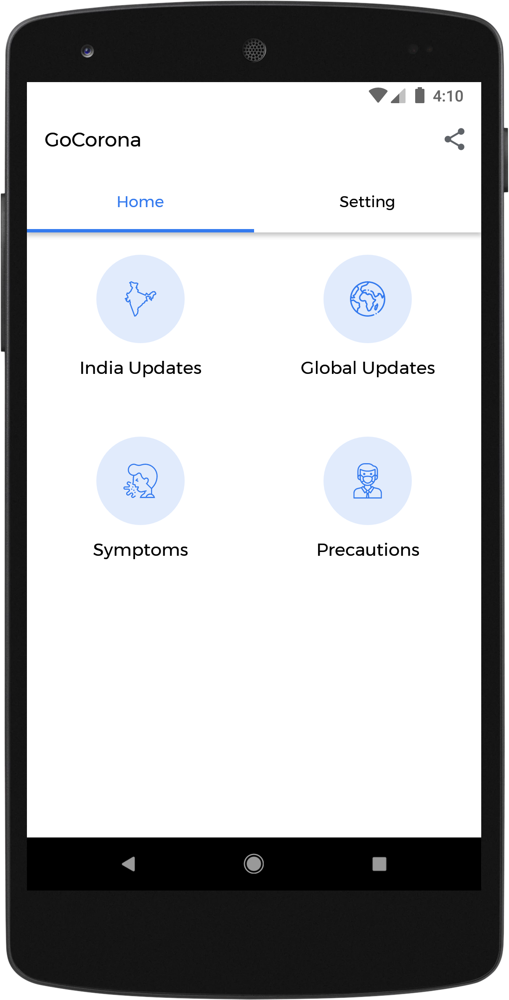
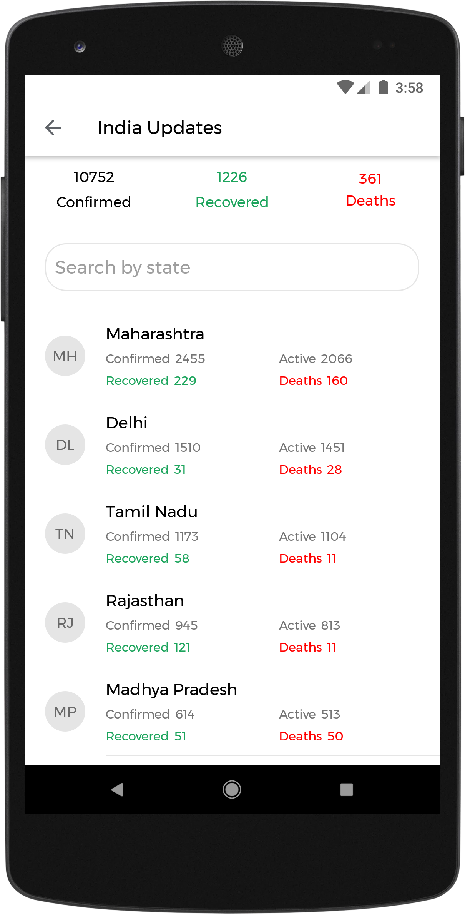
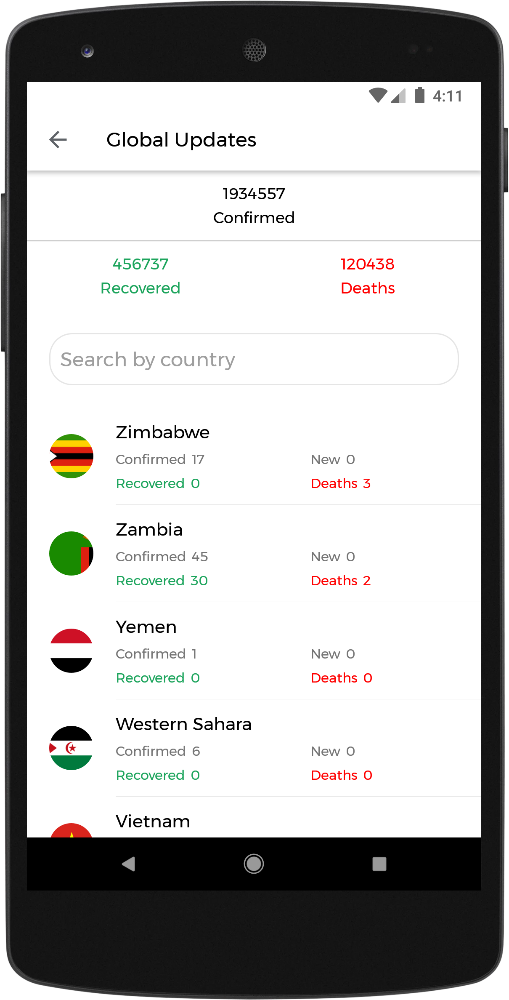

# GoCorona
The GoCorona is an Android application that provides the latest information and updates about the Corona Virus(COVID-19), from India and all Corona affected countries of the world.

# About
- It provides the state wise COVID-19 statistics in India.
- It also provides the COVID-19 statistics from all the Corona affected countries of the world.
- It gives the set of basic COVID-19 symptoms and precautions.

# Screenshots
<table style="width:100%">
  <tr>
    <th>OnBoarding</th>
    <th>Dashboard</th>
  </tr>
  <tr>
    <td></td>
    <td></td>
  </tr>
  <tr>
    <th>India Updates</th>
    <th>Global Updates</th>
  </tr>
  <tr>
    <td></td> 
    <td></td>
  </tr>
</table>

# Built With
- [Kotlin](https://kotlinlang.org) - Official programming language for Android application development by Google.
- [Retrofit](https://square.github.io/retrofit/) - A type-safe HTTP client for Android and Java.
- [RxJava 2](https://github.com/ReactiveX/RxJava/tree/2.x) - A library for composing asynchronous and event-based programs using observable sequences for the JVM.  
- [Android Architecture Components](https://developer.android.com/topic/libraries/architecture) - A set of Jetpack components which help you to design robust, testable and maintainable apps
  - [Data Binding](https://developer.android.com/topic/libraries/data-binding) - A support library that allows to bind UI components in layouts to data sources in app using a declarative format rather than programmatically. 
- [Android Material Components](https://github.com/material-components/material-components-android) - The material UI components for Android, designed and developed by Google.

# Credits
Thanks to [Postman CORONAVIRUS COVID19 API](https://documenter.getpostman.com/view/10808728/SzS8rjbc?version=latest) and [COVID19India.org](https://github.com/covid19india/api) for open-source API.

License
========

    Copyright 2020 Sushant Hande

    Licensed under the Apache License, Version 2.0 (the "License");
    you may not use this file except in compliance with the License.
    You may obtain a copy of the License at

       http://www.apache.org/licenses/LICENSE-2.0

    Unless required by applicable law or agreed to in writing, software
    distributed under the License is distributed on an "AS IS" BASIS,
    WITHOUT WARRANTIES OR CONDITIONS OF ANY KIND, either express or implied.
    See the License for the specific language governing permissions and
    limitations under the License.
